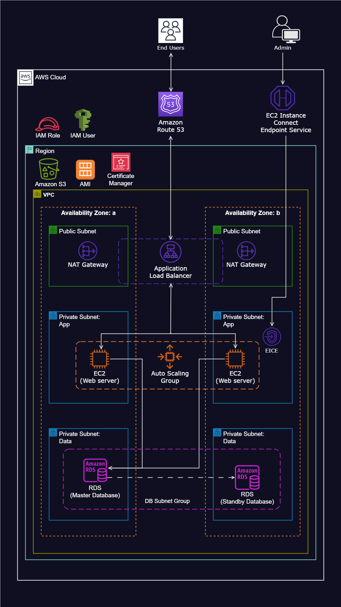

# Dynamic Website Deployment on AWS

---

## Project Overview
This project demonstrates the deployment of a dynamic website on AWS using various AWS services to ensure scalability, security, and high availability. The infrastructure is designed with a Virtual Private Cloud (VPC) spanning multiple Availability Zones, leveraging an Auto Scaling Group, Load Balancer, and other AWS services.

---
## AWS Resources Utilized
### **Networking and Security**
1. **Virtual Private Cloud (VPC):** Configured with both public and private subnets across two Availability Zones.

---
2. **Internet Gateway:** Enables communication between VPC instances and the internet.

---
3. **Security Groups:** Serve as a network firewall mechanism to regulate inbound and outbound traffic.

---
4. **Availability Zones:** Two Availability Zones were used to ensure fault tolerance and reliability.

---
5. **Public Subnets:** Used for the Application Load Balancer (ALB) and NAT Gateway.

---
6. **EC2 Instance Connect Endpoint:** Enables secure connections to assets within both public and private subnets.

---
7. **Private Subnets:** Web servers (EC2 instances) are placed in private subnets for enhanced security.

---
8. **NAT Gateway:** Allows instances in private subnets to access the internet while remaining secure.

---
### **Compute and Scalability**
9. **EC2 Instances:** Hosted the dynamic website.

---
10. **Application Load Balancer (ALB):** Distributes incoming traffic across an Auto Scaling Group of EC2 instances.

---
11. **Auto Scaling Group:** Automatically manages EC2 instances to ensure availability, scalability, fault tolerance, and elasticity.

---
### **Security and Monitoring**
12. **AWS Certificate Manager (ACM):** Secures application communications with SSL/TLS certificates.

---
13. **Simple Notification Service (SNS):** Configured to send notifications regarding Auto Scaling activities.

---
### **Domain and Storage**
14. **Amazon RDS:** Highly scalable database for managing user data and transactions.

---
15. **Route 53:** Domain name registration and DNS configuration for routing web traffic.

---
16. **Amazon S3:** Used to store application code.

---

## Monitoring and Alerts
- The Auto Scaling Group is configured with SNS to send notifications on instance scaling events.
- AWS CloudWatch can be used for monitoring instance performance and logging application errors.

## Conclusion
This project demonstrates a highly available, scalable, and secure architecture for hosting a dynamic website on AWS using best DevOps practices. By leveraging AWS services, I ensure seamless scalability, security, and efficient resource management.

---

